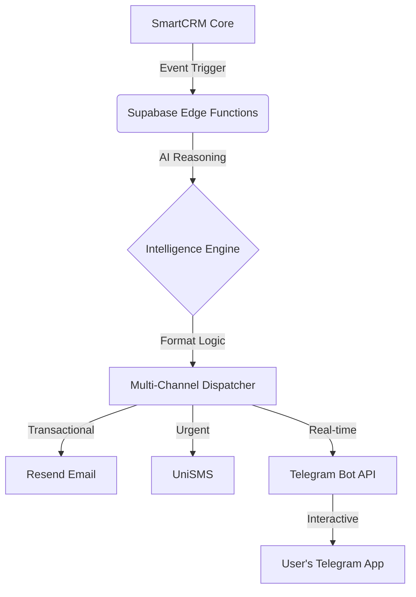

# Precodes Software Solutions

## SMARTCRM Logo

⚡ **SMARTCRM™ Enterprise OS**  
A Smart Customer Relationship Management (CRM) system designed for better customer relations and autonomous operations.

**Version** • **Framework** • **Backend** • **AI Agents** • **Performance** • **License**

**Engineered & Scaled by** Jack Daniel Pineda, Emmanuel Laurente & Jasmine Aira Nora

---

## 💎 Powered By Enterprise Infrastructure
**Supabase • Vercel • Google • Telegram • Stripe • HitPay • Sentry • Resend • PostHog • Microsoft Clarity • Better Stack • LogSnag • Zoom • UniSMS**

**Official Website** • **Documentation Portal** • **Support**

---

## 🧰 SMARTCRM Tech Stack (Resume)
**Languages**: TypeScript, JavaScript, Python, SQL  
**Frontend**: React 19, Vite, Tailwind CSS, Framer Motion  
**Backend**: Supabase (PostgreSQL 15), Supabase Edge Functions (Deno), Node.js APIs  
**AI / Automation**: Google Gemini 2.5 Flash, OpenRouter (Qwen/Mistral fallback), 40 AI Agents  
**Auth & Identity**: Supabase Auth, Google OAuth, Didit.me KYC/KYB  
**Payments**: Stripe, HitPay (QR Ph, Billease)  
**Messaging / Comms**: Resend (Email), UniSMS (SMS), Telegram Bot API, Google Meet, Zoom API, Daily.co  
**Analytics / Observability**: Sentry, PostHog, Microsoft Clarity, Better Stack, LogSnag  
**Hosting / DevOps**: Vercel, Supabase CLI/MCP, Supabase Realtime, Row Level Security (RLS)

---

## 🏙️ SMARTCRM Strategic AI & Automation
**Version:** v4.0.4-Stable (Growth Campaigns + Unified Recipient Engine + Web Form Leads)  
**Engine:** SMARTCRM Strategic Intelligence + Unified Growth Suite Logic

---

## 📋 Platform Modules

### Owner Dashboard (28 Modules)
| Section | Modules |
|---|---|
| Overview | Dashboard, Growth Hub, Inbox |
| Sales | Deals, Smart Pipeline, Contacts, Clients, Products & Quotes, Revenue |
| Work | Projects, Tasks, Team, Support |
| Channels | SMS Hub, Email Hub, Telegram Hub, Sequences, Calls, Meetings |
| Growth | Web Forms, Campaigns, Knowledge Base |
| Automation | Automation Hub (40 AI Agents), Agent Portal, AI Assistant |
| Account | Billing (Stripe), AI Credits, Settings |

### Client Portal (9 Modules)
| Module | Description |
|---|---|
| Home | Dashboard with project progress, task overview, invoices, meetings |
| Projects | View assigned projects with progress tracking |
| Tasks | Detailed task list across all projects with filters |
| Documents | Upload and download files with category filtering |
| Meetings | View scheduled meetings with join links (Google Meet, Zoom, Daily.co) |
| Support | Submit and track support tickets |
| Knowledge Base | Browse published help articles |
| Billing | View invoices and pay online via HitPay (QR Ph, Billease) |
| Settings | Profile and preferences |

---

## 💎 The SMARTCRM™ Vision
SMARTCRM™ is a full-featured CRM operating system built by Precodes Software Solutions. It combines traditional CRM capabilities with 40 AI automation agents that monitor, analyze, and act on your business data in real time.

The platform handles leads, contacts, clients, projects, tasks, invoicing, multi-channel communication (Email, SMS, Telegram, Video), and subscription billing — all in one system. With a dedicated Client Portal, your clients get their own login to view projects, pay invoices, submit tickets, and access documents.

**Key highlights:**
- **40 AI Agents:** Automated lead scoring, pipeline monitoring, project health checks, invoice reminders, and more.
- **Multi-Channel Communication:** Email (Resend), SMS (UniSMS), Telegram Bot, Google Meet, Zoom, Daily.co.
- **Client Portal:** 9 dedicated views for clients including online payments via HitPay.
- **Feature-First Architecture:** All modules built as independent features for fast loading and easy maintenance.
- **Real-Time Updates:** Live data sync via Supabase Realtime subscriptions.
- **Multi-Tenant Workspaces:** Full data isolation with Row Level Security.

---

## 🛡️ SMARTCRM: Security
SMARTCRM™ uses multiple layers of security to protect your data.

### 🔐 1. PostgreSQL Row Level Security (RLS)
- Every database query is filtered at the Postgres level using RLS policies.
- All data is scoped to the user's workspace — no cross-tenant access is possible.
- Even direct database access cannot bypass workspace isolation.

### 🏢 2. Multi-Tenant Workspace Isolation
- Each workspace is fully independent.
- Separate data for Leads, Projects, Tasks, Clients, and all other modules.
- **Role-Based Access Control (RBAC):** Owner, Admin, Member, Observer, Client roles with different permissions.

### 🆔 3. Identity Verification (KYC)
Integration with Didit.me for identity verification.
- Passport and ID document verification across 150+ countries.
- Liveness checks to prevent fraud.
- Verified badge displayed on user profiles.

### 🤖 4. AI Data Privacy
- Your data is never used to train AI models.
- AI context is session-scoped and cleared after each request.
- Files are accessed via time-limited signed URLs (never publicly exposed).

### 📜 5. Audit Trails
Every action is logged.
- Full activity history for all system operations.
- Admin monitoring of team activity.
- Sentry error tracking with session replays.
- Telegram Error Alerts to lead developer (@jpineda) via custom sentry-alerts webhook bridge.

### 📞 6. Communication & Phone Support
Phone number support across the entire CRM with Philippine locale.
- Unified phone numbers for Team Members, Clients, Leads, and Contacts.
- Philippine Format (+63) auto-formatting.
- Profile Management for contact details from Settings.

### 💬 7. UniSMS & Email Hub
**📱 UniSMS Hub**
- Dedicated SMS Module with recipient picker, composer, and delivery log.
- 22 Templates organized into 6 categories.
- 5 targeting modes — Single, All Leads, All Contacts, All Team, Project Members.
- Real-time delivery tracking.

**📧 Email Hub**
- 3-Panel Layout: recipient directory, AI composer, delivery log.
- One-click AI-generated drafts using Gemini.
- Bulk broadcasts to All Leads/Clients/Team with preview.
- Templates with merge tags and open/click tracking.

### 🤖 8. Telegram Bot (@SmartCRMS_bot)
Real-time notifications and interactive CRM commands via Telegram.

**Commands**
| Command | Action |
|---|---|
| /start | Connect your SmartCRM account |
| /tasks | View top 5 open tasks |
| /leads | View latest 5 leads |
| /pipeline | Sales pipeline summary |
| /invoices | Recent invoices (clients) |
| /meetings | Upcoming meetings (clients) |
| /status | Connection info |
| /help | Command menu |

AI Chat: Ask questions about your business data directly in Telegram.

---

## 📡 Notification Architecture

---

## 🌐 Google Workspace & Identity Ecosystem
SMARTCRM™ features a deep, two-way integration with Google services, managed through a secure, split-scope OAuth 2.0 strategy.

---

## 👔 Team Management
- RBAC: Admin, Member, Observer roles.
- Secure onboarding via workspace invitations.
- Performance metrics for velocity, completion, and contributions.

---

## 🤝 Clients & Contacts: Relationship OS
- 360° Profile: unified interaction history.
- Branded ID Cards for contacts.
- Full audit trails.

---

## 🤖 Automation Hub: Central Intelligence (40 Active Agents)
- Agent Marketplace for Sales, Finance, Ops, HR, Productivity.
- Dynamic Config Engine for thresholds, timings, recipients.
- Production CRM write toggles (default off).
- Context-Aware Email Templates with role-based greetings.
- 5-Way Notify Mode: Email, SMS, Telegram, E+S, All.
- Activity Telemetry with reasoning steps and delivery metrics.

---

## 🌐 Agent Portal: The Client Gateway
- Live Project Tracking with real-time updates.
- Mobile-first UX with Light/Dark mode.
- Deliverable approval loops.
- Project chat and secure credential management.

---

## 🤖 AI Assistant: Your Operational Co-Pilot
- Natural language operations.
- Data synthesis and actionable insights.

---

## 💳 Billing (Stripe)
- Branded PDF invoices.
- Recurring billing + plan-based access.
- Revenue tracking.

---

## 💰 HitPay Payment Gateway
- QR Ph (GCash, PayMaya) and Billease support.
- USD → PHP conversion for checkout.
- Webhook processing and audit trail.

---

## 🚀 Key Performance Indicators
| 🤖 AI Automation | 🔒 Hardened Security | ⚡ Real-Time Sync |
|---|---|---|
| Blueprint Generator: projects in 2 seconds | Row Level Security: zero data leakage | Instant updates: 0ms latency |
| Predictive Health: AI detects risks | Signed Storage: 256-bit AES | Live pipelines in real-time |

---

## ⚡ Performance Engineering (v2.5.0)
| Metric | Before | After |
|---|---|---|
| Initial Dashboard Load | 3–8 seconds | < 800ms (Phase 1 data only) |
| Initial Bundle Size (JS) | ~3.8MB (Monolith) | < 300KB (Route Lazily Loaded) |
| Tab Switch Behavior | Reset to loading screen | Stays in place — no reload |
| Return Visit Load | Full network round-trip | Near-instant from browser cache |
| Auth Stability | Race condition → required refresh | Stable PKCE — session handling fixed |
| DB Payload (Leads/Tasks) | select('*') — all columns | Explicit columns only — smaller payload |
| State Architecture | Monolithic useCRMStore (3000+ lines) | Decoupled Features — TanStack Query hooks + Service layer |

---

## 🆕 CRM Growth Suite (v4.0.0) — 15 New Modules
*(Full module descriptions retained as provided.)*

---

## 🤖 The SMARTCRM AI Agent Ecosystem (40 Agents)
SMARTCRM runs 40 AI agents powered by Gemini 2.5 Flash. Each agent queries live database data and routes reports to the appropriate recipients based on role permissions.

*(Full agent details retained as provided.)*

---

## 💎 Integration Overview
SMARTCRM connects to the following services for a complete business platform.

**Core Infrastructure & Security**: Supabase, Vercel, Didit.me  
**Strategic Intelligence Layer**: Gemini 2.5 Flash, OpenRouter  
**Multi-Channel Communication**: UniSMS, Resend, Telegram Bot API, Daily.co, Zoom API  
**Observability & Analytics**: Sentry, Microsoft Clarity, PostHog, Better Stack, LogSnag  
**Financials & Operations**: Stripe, Google Calendar & Meet

---

## 📅 Google Calendar — Tasks 2‑Way Sync (SmartCRM ↔ Google)
**Sync details**
- SmartCRM → Google: task updates create/update/delete calendar events.
- Google → SmartCRM: manual pull sync in Settings.

**OAuth scopes**
- Login: openid email profile
- Calendar: requested only when enabling sync

**Database fields**
- tasks.google_event_id
- tasks.google_calendar_synced_at
- tasks.google_calendar_sync_status

**Data provenance**
- Stored in agent_activity_log.data_sources (jsonb)

---

## 📖 Essentials Documentation & Deployment
*(Full guides list retained as provided.)*

---

## 🗺️ SMARTCRM™ Strategic Development Roadmap
*(Full roadmap retained as provided.)*

---

## 🚀 Deployment & Installation Guide
*(Full deployment guide retained as provided.)*

---

## 📂 Architecture Blueprint
*(Full architecture tree retained as provided.)*

---

## ⚖️ Proprietary Enterprise License
© 2026 Precodes Software Solutions. All Rights Reserved.

This software is NON-OPEN SOURCE. Access to and use of this source code is strictly limited to authorized enterprise clients and licensed team members.

**Brand:** Precodes Software Solutions™  
**Engineering Lead:** Jack Daniel Pineda & Emmanuel Laurente  
**Documentation Specialist:** Jasmine Aira Nora  
**Jurisdiction:** Metro Manila, Philippines

Unauthorized redistribution or reverse engineering will be met with legal action under Philippines Intellectual Property and Cybercrime Law.

---

**Precodes Software Solutions**  
“Where Innovation Meets Execution.”  
Engineered & Developed by Jack Daniel Pineda, Emmanuel Laurente & Jasmine Aira Nora  
*Tatak Precodes - Building the Future of Enterprise Technology.*
